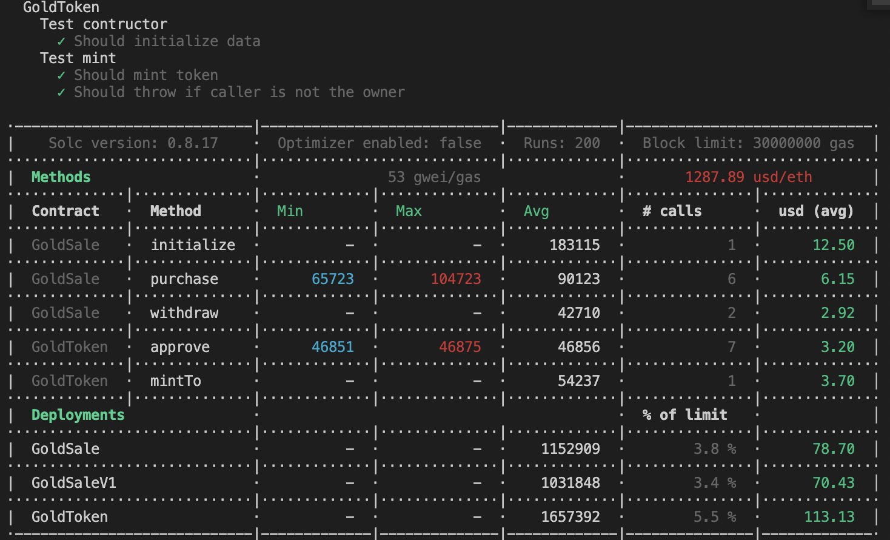

# Usage
## Test
Note: make sure you have COINMARKETCAP_KEY in .env and update the last GAS_PRICE to able see fiat price.
```
$ npm run test
```


## Deploy
Note: make sure that you have MNEMONIC or PRIVATE_KEYS in .env and ethers on your acocunt.
```
$ npx hardhat run --network goerli scripts/deploy.js
deployed GoldToken to 0x9C9Ba8f6B85008125BFDdD668A485bd1a8Ee6475
GoldSaleV1 deployed to 0x5FC3942BF96b7D25686aC1E6c019aa03ABd5CE9E
Upgraded GoldSale to 0x5FC3942BF96b7D25686aC1E6c019aa03ABd5CE9E
```

## Interact with contract by Hardhat console

```
# Open hardhat console
$ npx hardhat console --network goerli

# Check imported accounts
> let accounts = await ethers.getSigners()
> accounts[0].address
'0xfbC410a7f679aA29533036ccC8d4EFDeE2dA983d'
> accounts[1].address
'0xb0a3425Aa5978124bBe8F5391ABEF488495B9f6E

# Check gold escrow account balance and approve to GoldSale contract
> const GoldToken = await ethers.getContractFactory('GoldToken')
> const goldToken = await GoldToken.attach('0x9C9Ba8f6B85008125BFDdD668A485bd1a8Ee6475')
> await goldToken.balanceOf("0xb0a3425Aa5978124bBe8F5391ABEF488495B9f6E");
BigNumber { value: "100000000000000000" }
> await goldToken.connect(accounts[1]).approve("0x5FC3942BF96b7D25686aC1E6c019aa03ABd5CE9E", "123456789");

# User purchase GoldToken from GoldSale
> const GoldSale = await ethers.getContractFactory('GoldSale')
> const goldSale = await GoldSale.attach('0x5FC3942BF96b7D25686aC1E6c019aa03ABd5CE9E')
> await goldSale.connect(accounts[0]).purchase("2", {value: "2460000000000000"});

# Check User balance
> await goldToken.balanceOf(accounts[0].address);
BigNumber { value: "2" }
> .exit
```
## Contracts Utils

### Format solidity and javascript source code
```
$ npm run prettier
```

### Solidity code linter
```
$ npm run contract-check
```

### Check contract size
```
$ npm run contract-size
 ·-----------------|--------------|----------------·
 |  Contract Name  ·  Size (KiB)  ·  Change (KiB)  │
 ··················|··············|·················
 |  GoldSaleV1     ·       4.448  ·                │
 ··················|··············|·················
 |  GoldSale       ·       4.996  ·                │
 ··················|··············|·················
 |  GoldToken      ·       6.543  ·                │
 ·-----------------|--------------|----------------·
```

### Verify contract on etherscan
Note: make sure you have ethereumscan key in .env to able verify the contract
```
$ npx hardhat verify --network goerli 0x5FC3942BF96b7D25686aC1E6c019aa03ABd5CE9E
Verifying implementation: 0x42Eb203D7677D4D9F372253074647f33ACD52EFa
Nothing to compile
Successfully submitted source code for contract
contracts/GoldSale.sol:GoldSale at 0x42Eb203D7677D4D9F372253074647f33ACD52EFa
for verification on the block explorer. Waiting for verification result...

Implementation 0x42Eb203D7677D4D9F372253074647f33ACD52EFa already verified.
Verifying proxy: 0x5FC3942BF96b7D25686aC1E6c019aa03ABd5CE9E
Contract at 0x5FC3942BF96b7D25686aC1E6c019aa03ABd5CE9E already verified.
Linking proxy 0x5FC3942BF96b7D25686aC1E6c019aa03ABd5CE9E with implementation
Successfully linked proxy to implementation.
Verifying proxy admin: 0x4504133cB14f883a30aB31A6e64D05bE44d17552
Contract at 0x4504133cB14f883a30aB31A6e64D05bE44d17552 already verified.

Proxy fully verified.
```

## Git hook scripts
### pre-commit: 
- It runs hooks on every commit to format the code and automatically point out issues in code such as missing semicolons, trailing whitespace, and debug statements.
- You can custom pre-commit commands in your package.json
```
  "pre-commit": [
    "prettier",
    "verify"
  ]
```

Note: you can skip pre-commit by the following command
```
git commit -m "commit message" --no-verify
```

### pre-push: 
- It is useful for identifying issues and passing all unit-tests before submission to code review.
- You can custom pre-push commands in your package.json
```
  "pre-push": [
    "prettier",
    "verify",
    "test"
  ]
```

Note: you can skip pre-push by the following command
```
git push --no-verify
```